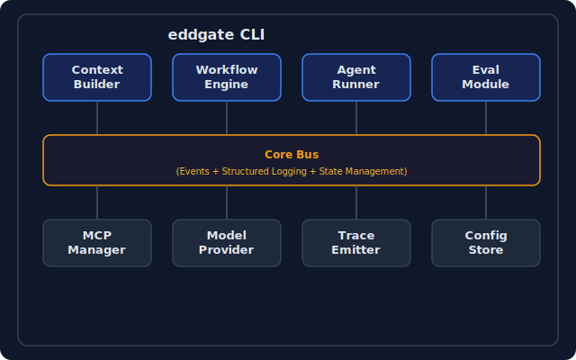
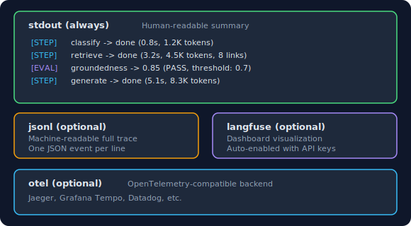
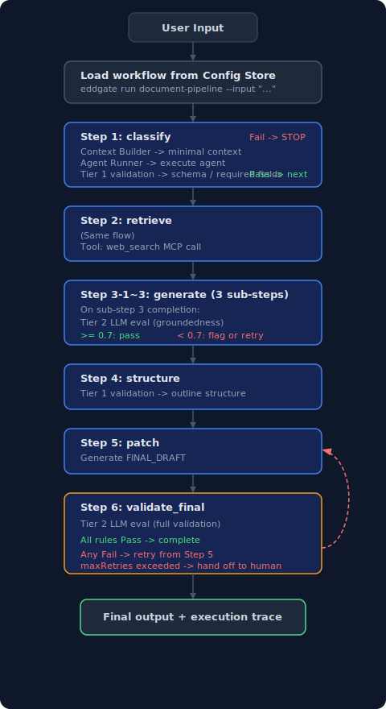
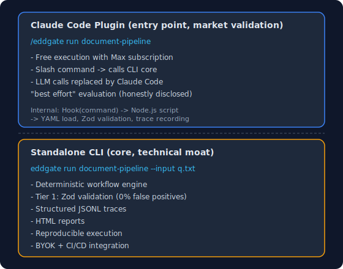

# eddgate: Architecture

> Version: 0.1.0
> Date: 2026-03-29

---

## What eddgate is

A self-improving evaluation loop for LLM workflows:

```
run -> analyze -> test -> run (improved) -> ...
```

Three things combined that don't exist together anywhere else:
1. **Validation gates** (EDDOps) -- deterministic checks between workflow steps
2. **Error analysis** (Hamel Husain's approach) -- cluster failures, auto-generate rules
3. **Regression testing** (Percy/Chromatic for agents) -- snapshot behavior, diff changes

---

## Design Principles

1. **Less is more** -- 100-token summary > 10,000-token raw (Anthropic)
2. **Default simple** -- single agent, pipeline topology, add complexity only when needed
3. **Gates not walls** -- rule-based checks every step, LLM eval only at key transitions
4. **Observe don't platform** -- JSONL traces + Langfuse/OTel hooks, not a custom dashboard
5. **Loop not line** -- failures feed back as rules for the next run
6. **Reproducible** -- same input = same execution path

---

## System Overview

<p align="center">
  
</p>

---

## Module Details

### 1. Context Builder

**Purpose**: Ensure execution stability and reproducibility. The focus is on execution definitions, not prompts.

**Design (reflecting CRITICAL_ANALYSIS)**:
- Not heavy JSON schema enforcement, but a **minimal execution context**
- "Less is more" -- context rot begins at 50K tokens (Chroma research)

```typescript
// Minimal execution context structure -- only this is enforced
interface ExecutionContext {
  state: "classify" | "retrieve" | "generate" | "validate" | "transform" | "human_approval" | "record_decision";
  identity: {
    role: string;        // "link_researcher" | "content_consolidator" | ...
    model: string;       // "sonnet"
    constraints: string[]; // ["raw_url_only", "no_hallucination"]
  };
  tools: string[];       // ["web_search", "file_read", ...]
  // Memory is optional -- no default. Inject only when needed
  memory?: {
    summary: string;     // Summary under 100 tokens
    previousStepOutput?: string; // Previous step output (only when needed)
  };
}
```

**What we don't do**:
- [no] General-purpose memory layers (hot/cold/archival) -- the reason MemGPT/Letta failed
- [no] Automatic context summarization -- JetBrains: LLM summarization lost to observation masking in 4 out of 5 cases
- [no] Injecting full conversation history -- causes context rot

**What we do**:
- [done] Pin execution context in code (reproducible)
- [done] Pass only the minimum information needed for each step
- [done] Inject previous step output only when explicitly needed
- [done] State transition validation -- warn on suspicious state transitions (e.g., classify -> validate directly)
- [done] Safe JSON truncation -- guarantee that truncated JSON does not produce malformed output
- [done] MCP tool name validation -- validate mcp:server:tool format (block invalid tool names early)

---

### 2. Workflow Engine

**Purpose**: Eliminate one-off execution. Guarantee consistent execution order and separation of concerns.

**Core rules (based on production experience)**:
1. Retrieval and generation must be separate steps
2. Validation step is mandatory
3. Results with insufficient evidence must not pass to the next step

```typescript
interface WorkflowDefinition {
  name: string;
  description: string;
  steps: StepDefinition[];
  // Workflow-level config
  config: {
    defaultModel: string;          // Default model (single provider recommended)
    topology: "single" | "pipeline" | "parallel"; // Explicitly chosen by user
    onValidationFail: "block" | "flag" | "retry";
  };
}

interface StepDefinition {
  id: string;
  name: string;
  type: "classify" | "retrieve" | "generate" | "validate" | "transform" | "human_approval";
  // Per-step model override (optional, defaults to workflow model)
  model?: string;
  // Execution context (created by Context Builder)
  context: ExecutionContext;
  // Rule-based validation (every step, zero cost)
  validation?: {
    rules: ValidationRule[];  // Schema check, required fields, format
  };
  // LLM evaluation (only at key transitions, optional)
  evaluation?: {
    enabled: boolean;
    type: "groundedness" | "relevance" | "custom";
    threshold: number;       // 0.0 ~ 1.0
    onFail: "block" | "flag" | "retry";
  };
  // Dependencies
  dependsOn?: string[];      // Previous step IDs
  // Output schema (structure passed as input to the next step)
  outputSchema?: JSONSchema;
}

interface ValidationRule {
  type: "schema" | "required_fields" | "format" | "length" | "regex" | "range" | "enum" | "not_empty" | "custom";
  spec: Record<string, unknown>;
  message: string;           // Message on failure
}
```

**Mapping your 6-step pipeline to this structure**:

```yaml
# workflows/document-pipeline.yaml
name: "eddgate Document Pipeline"
description: "6-step document processing pipeline (production-proven)"

config:
  defaultModel: "sonnet"
  topology: "pipeline"
  onValidationFail: "block"

steps:
  # Step 1: Problem refinement
  - id: "classify"
    name: "Problem Refinement"
    type: "classify"
    context:
      state: "classify"
      identity:
        role: "problem_analyzer"
        constraints: ["organize_as_section_headings"]
      tools: []
    validation:
      rules:
        - type: "required_fields"
          spec: { fields: ["topics"] }
          message: "Topic list is required"
        - type: "schema"
          spec: { topics: "array", minItems: 1 }
          message: "At least 1 topic required"
    outputSchema:
      type: "object"
      properties:
        topics: { type: "array", items: { type: "string" } }

  # Step 2: Link collection
  - id: "retrieve"
    name: "Relevant Links per Topic"
    type: "retrieve"
    context:
      state: "retrieve"
      identity:
        role: "link_researcher"
        constraints: ["raw_url_only", "no_speculation", "verified_links_only"]
      tools: ["web_search"]
    dependsOn: ["classify"]
    validation:
      rules:
        - type: "regex"
          spec: { pattern: "^https?://", field: "urls" }
          message: "URLs must start with http/https"
        - type: "required_fields"
          spec: { fields: ["link_pack"] }
          message: "Link package per topic is required"

  # Step 3: Answer generation (3 sub-steps)
  - id: "generate_taxonomy"
    name: "Taxonomy Design + Classification"
    type: "generate"
    dependsOn: ["retrieve"]
    context:
      state: "generate"
      identity:
        role: "content_consolidator"
        constraints: ["no_prose_polishing", "developmental_editing"]
      tools: []
    validation:
      rules:
        - type: "required_fields"
          spec: { fields: ["issue_brief", "redundancy_log"] }
          message: "ISSUE_BRIEF and REDUNDANCY_LOG are required"

  - id: "generate_flow"
    name: "Flow Editing"
    type: "generate"
    dependsOn: ["generate_taxonomy"]
    context:
      state: "generate"
      identity:
        role: "flow_editor"
        constraints: ["no_new_facts", "conclusion_evidence_condition_exception_action_order"]
      tools: []

  - id: "generate_citation"
    name: "Citation Editing"
    type: "generate"
    dependsOn: ["generate_flow"]
    # -- Key transition: retrieval and generation results merge. LLM eval only here --
    evaluation:
      enabled: true
      type: "groundedness"
      threshold: 0.7
      onFail: "flag"
    context:
      state: "generate"
      identity:
        role: "copy_citation_editor"
        constraints: ["no_inline_links", "citation_brackets_only", "raw_url_only_reference"]
      tools: []

  # Step 4: Structure design
  - id: "structure"
    name: "Document Structure Design"
    type: "transform"
    dependsOn: ["generate_citation"]
    context:
      state: "validate"
      identity:
        role: "information_architect"
        constraints: ["no_content_changes", "structure_only"]
      tools: []
    validation:
      rules:
        - type: "required_fields"
          spec: { fields: ["outline", "section_mapping"] }
          message: "Outline and section mapping are required"

  # Step 5: Patch execution + document generation
  - id: "patch"
    name: "Document Verification and Generation"
    type: "generate"
    dependsOn: ["structure"]
    context:
      state: "generate"
      identity:
        role: "patch_executor"
        constraints: ["fix_only_FAIL_AMBIG_in_VALIDATION_TABLE"]
      tools: ["file_write"]

  # Step 6: Final validation (retry loop)
  - id: "validate_final"
    name: "Final Validation"
    type: "validate"
    dependsOn: ["patch"]
    # -- Key transition: final artifact validation. LLM eval --
    evaluation:
      enabled: true
      type: "custom"
      threshold: 0.7  # industry standard (LLM judge agreement ~80-85%, 0.9+ is unreachable)
      onFail: "retry"  # Return to patch step and re-execute
    context:
      state: "validate"
      identity:
        role: "artifact_validator"
        constraints: ["no_modifications", "pass_fail_only"]
      tools: []
    validation:
      rules:
        - type: "custom"
          spec: { check: "all_sections_present" }
          message: "Required sections missing"
        - type: "custom"
          spec: { check: "reference_consistency" }
          message: "[n] citations and references are inconsistent"
```

**Topology options (explicitly chosen by user)**:

```yaml
# Default: single -- one agent executes sequentially
topology: "single"

# pipeline -- different agent per step (like your 6-step pipeline)
topology: "pipeline"

# parallel -- run independent steps concurrently (e.g., classify + retrieve simultaneously)
topology: "parallel"
```

No automatic selection. Google research conclusion: 13% misclassification rate of auto-selection x -70% worst case = not production-viable.

---

### 3. Agent Runner

**Purpose**: Define and execute agent roles.

```typescript
interface AgentRole {
  id: string;
  name: string;                    // "backend_dev" | "qa_engineer" | ...
  description: string;
  systemPrompt: string;            // Role prompt
  model: string;                   // Default model
  tools: string[];                 // Available tools
  mcpServers?: string[];           // MCP servers to connect
  constraints: string[];           // Constraints
}
```

**Predefined roles (project requirements)**:

| Role | Description | Default Tools |
|------|-------------|---------------|
| `backend_dev` | Backend code generation/modification | file_read, file_write, shell, web_search |
| `frontend_dev` | Frontend code generation/modification | file_read, file_write, shell, web_search |
| `ai_engineer` | AI/ML related tasks | file_read, file_write, shell, web_search, model_eval |
| `qa_engineer` | Test writing/execution/verification | file_read, shell, test_runner |
| `code_reviewer` | Code review/quality verification | file_read, git_diff, lint |
| `doc_writer` | Documentation writing/organization | file_read, file_write, web_search |
| `link_researcher` | Evidence link collection/verification | web_search |
| `validator` | Artifact verification (no modifications) | file_read |

**User-defined roles**: Freely add via YAML.

---

### 4. Eval Module

**Purpose**: The spirit of eddgate -- evaluation is built into the design, not an afterthought. But realistically.

**Reflecting CRITICAL_ANALYSIS -- 3-tier evaluation**:

```
Tier 1: Rule-based validation (every step, zero cost, 5-10ms)
  -> Schema check, required fields, format, regex, length, range, enum, not_empty
  -> 100% deterministic. 0% false positives.

Tier 2: LLM evaluation (key transitions only, 1-5s, optional)
  -> groundedness, relevance, custom rubric
  -> Activated only at retrieval-generation merge points and final artifacts
  -> Result is "block" or "flag" (flag = proceed but warn)

Tier 3: Post-hoc offline analysis (async, no limits)
  -> Retrospective quality analysis based on full traces
  -> Braintrust/DeepEval/RAGAS integration
  -> Runs in CI/CD (auto-triggered on prompt changes)
```

```typescript
// Tier 1: Rule-based (synchronous, every step)
interface RuleValidation {
  type: "schema" | "required_fields" | "format" | "regex" | "length" | "range" | "enum" | "not_empty";
  spec: Record<string, unknown>;
  // On failure: block immediately. Do not pass to next step.
}

// Tier 2: LLM evaluation (synchronous, key transitions only)
interface LLMEvaluation {
  type: "groundedness" | "relevance" | "custom";
  model?: string;        // Dedicated eval model (default: small model)
  rubric: string;        // Evaluation criteria
  threshold: number;     // 0.0 ~ 1.0
  onFail: "block" | "flag" | "retry";
  maxRetries?: number;   // Max retries on retry (default: 2)
}

// Tier 3: Post-hoc analysis (async)
interface OfflineEval {
  type: "batch_groundedness" | "batch_relevance" | "regression" | "custom";
  dataset: string;       // Evaluation dataset path
  output: string;        // Result output path
  // CI/CD integration: auto-run on prompt/workflow changes
  trigger: "on_prompt_change" | "on_workflow_change" | "manual" | "cron";
}
```

---

### 5. MCP Manager

**Purpose**: Plug-and-play connection for tools, RAG, and external services.

```typescript
interface MCPConfig {
  servers: MCPServerDefinition[];
}

interface MCPServerDefinition {
  name: string;
  transport: "stdio" | "http" | "sse";
  command?: string;        // stdio: execution command
  url?: string;            // http/sse: server URL
  env?: Record<string, string>;
  // Per-agent access control
  allowedRoles?: string[]; // Roles allowed to use this MCP
}
```

**Built-in MCPs**:
- `web_search` -- Web search (Firecrawl, Brave, etc.)
- `file_ops` -- File read/write/search
- `shell` -- Shell command execution
- `git` -- Git operations

**User-added MCPs**: Declare in the config file and they are connected automatically.

---

### 6. Model Provider

**Purpose**: Single provider as default + optional overrides.

**Reflecting CRITICAL_ANALYSIS**:
- Default: single provider, single model family
- Different providers per step is discouraged (API incompatibility, test explosion, failure propagation)
- Realistic maximum: small (classification/validation) + large (generation) 2-tier

```typescript
interface ModelConfig {
  // Default model (used across all steps)
  default: string;               // "sonnet"
  // Optional overrides (user-specified)
  overrides?: {
    classify?: string;           // For classification (can be a small model)
    generate?: string;           // For generation (large model)
    validate?: string;           // For validation (can be a small model)
  };
  // AI Gateway config (optional)
  gateway?: {
    enabled: boolean;
    fallback?: string[];         // Fallback model list
    tags?: string[];
  };
  // Direct provider (when not using Gateway)
  provider?: {
    type: "anthropic" | "openai" | "google" | "custom";
    apiKey: string;              // Environment variable reference
    baseUrl?: string;
  };
}
```

---

### 7. Trace Emitter

**Purpose**: An observable framework. Hooks and integrations, not a custom platform.

**Reflecting CRITICAL_ANALYSIS**:
- No building a custom observability platform (50-100 person-months)
- Structured JSON logging (day 1, zero cost)
- Langfuse/OTel integration (optional)
- Community extension via callback hooks

```typescript
interface TraceEvent {
  timestamp: string;           // ISO 8601
  traceId: string;             // Full execution trace ID
  spanId: string;              // Current span ID
  parentSpanId?: string;       // Parent span ID (supports span hierarchy)
  stepId: string;              // Current step ID
  type: "step_start" | "step_end" | "llm_call" | "tool_call" | "validation" | "evaluation" | "error";
  // Execution context snapshot (for reproducibility)
  context: ExecutionContext;
  // Details
  data: {
    model?: string;
    inputTokens?: number;
    outputTokens?: number;
    latencyMs?: number;
    cost?: number;             // Estimated USD
    validationResult?: "pass" | "fail";
    evaluationScore?: number;
    error?: string;
  };
}

// Output targets (multiple simultaneous outputs supported)
interface TraceOutput {
  type: "stdout" | "jsonl_file" | "langfuse" | "otel" | "custom";
  config?: Record<string, unknown>;
}

// TraceEmitter API
// emitter.toolCall(stepId, toolName, input, output) -- record tool calls (automatic span hierarchy)
// emitter.flush() -- force-send buffered events to output targets
// MAX_BUFFER_SIZE = 10,000 -- auto-flush when buffer is exceeded
```

**Logging strategy**:

<p align="center">
  
</p>

---

### 8. Config Store

**Purpose**: Manage prompts, workflows, and roles as version-controlled files.

```
project/
├── eddgate.config.yaml          # Project config (model, MCP, trace)
├── workflows/
│   ├── document-pipeline.yaml  # 6-step document pipeline
│   ├── code-review.yaml        # Code review workflow
│   ├── bug-fix.yaml            # Bug fix workflow
│   ├── api-design.yaml         # API design workflow
│   ├── translation.yaml        # Translation workflow
│   └── rag-pipeline.yaml       # RAG indexing pipeline (Pinecone MCP)
├── roles/
│   ├── backend_dev.yaml
│   ├── qa_engineer.yaml
│   └── custom_role.yaml
├── prompts/
│   ├── link_researcher.md      # System prompt per role
│   ├── content_consolidator.md
│   └── artifact_validator.md
├── eval/
│   ├── rules/                  # Tier 1 rule definitions
│   ├── rubrics/                # Tier 2 LLM evaluation criteria
│   └── datasets/               # Tier 3 offline evaluation data
└── traces/                     # Execution traces (JSONL)
```

**Everything goes into Git** -- prompt versioning, workflow change history, evaluation criteria tracking.
This is the core of GenAIOps: `prompt_versioning` + `workflow_versioning` = Git.

---

## Execution Flow

<p align="center">
  
</p>

**LLM evaluation happens in only 2 places**: after Step 3 completion (retrieval-generation merge) + Step 6 (final validation).
Everything else is purely rule-based (zero cost, 5-10ms).

---

## Output Layer (Renderers)

Three renderers for the same `WorkflowResult` data:

```
WorkflowResult (single data source)
    |
    |---> StdoutRenderer   -- real-time logs during execution (always)
    |---> TUIRenderer      -- interactive terminal dashboard after execution (--tui)
    └---> HTMLRenderer     -- static report file (--report)
```

### StdoutRenderer (Phase 1, implemented)

Outputs step-by-step progress to the terminal in real time during execution.

### HTMLRenderer (Phase 1)

`eddgate run ... --report report.html` -- generates a single HTML file.
- Zero dependencies. Pure HTML/CSS/JS string templates
- Collapsible sections per step, evaluation score gauges, token/cost/time tables
- Send a single file to the partner and you are done
- Includes a button to download the full trace JSON

### TUIRenderer (Phase 2)

`eddgate run ... --tui` -- interactive terminal dashboard after execution completes.
- Step list + detail panel (2-pane)
- Arrow keys to navigate steps, Enter to view input/output
- Evaluation results highlighted, failed steps in red
- Lightweight library (Ink or blessed-contrib)

---

## CLI Interface

```bash
# Run a workflow
eddgate run <workflow> --input <file> [--report <path>] [--tui] [--trace-jsonl <path>]

# Run a single step (for debugging)
eddgate step <workflow> <step-id> --input <file>

# View traces
eddgate trace <trace-id-or-file> [--format json|summary]

# Offline evaluation
eddgate eval <workflow> [--dataset <path>] [--output <path>] [--model <model>]

# List workflows/roles
eddgate list workflows
eddgate list roles
```

---

## Tech Stack

| Layer | Choice | Rationale |
|-------|--------|-----------|
| **Language** | TypeScript | npm ecosystem, type safety |
| **LLM calls** | Claude Agent SDK (`@anthropic-ai/claude-agent-sdk`) | Internal Claude Code CLI calls, Max subscription utilization, no API key required |
| **CLI framework** | Commander.js | Mature CLI tool |
| **Config parsing** | yaml + zod v4 | YAML config + type-safe validation |
| **Trace output** | Custom JSONL + stdout | Minimal cost, extensible |
| **Testing** | vitest | Fast execution, native ESM |
| **Rendering** | Custom HTML + readline TUI | Zero external dependencies |

---

## Project Directory Structure

```
eddgate/
├── package.json
├── tsconfig.json
├── README.md
├── RESEARCH_ANALYSIS.md           # Market analysis
├── CRITICAL_ANALYSIS.md           # Reality check
├── ARCHITECTURE.md                # This document
│
├── src/
│   ├── cli/                       # CLI entry point
│   │   ├── index.ts               # Main CLI
│   │   ├── commands/
│   │   │   ├── run.ts             # eddgate run
│   │   │   ├── step.ts            # eddgate step
│   │   │   ├── eval.ts            # eddgate eval
│   │   │   ├── trace.ts           # eddgate trace
│   │   │   ├── mcp.ts             # eddgate mcp
│   │   │   └── list.ts            # eddgate list
│   │   └── utils/
│   │
│   ├── core/                      # Core modules
│   │   ├── context-builder.ts     # Execution context creation
│   │   ├── workflow-engine.ts     # Workflow execution engine
│   │   ├── agent-runner.ts        # Agent execution
│   │   ├── model-provider.ts      # Model call abstraction
│   │   └── bus.ts                 # Event bus
│   │
│   ├── eval/                      # Evaluation module
│   │   ├── tier1-rules.ts         # Rule-based validation
│   │   ├── tier2-llm.ts          # LLM evaluation
│   │   └── tier3-offline.ts       # Post-hoc analysis
│   │
│   ├── mcp/                       # MCP management
│   │   ├── manager.ts             # MCP server management
│   │   └── builtin/               # Built-in MCP servers
│   │       ├── web-search.ts
│   │       ├── file-ops.ts
│   │       └── shell.ts
│   │
│   ├── trace/                     # Trace
│   │   ├── emitter.ts             # Event emission
│   │   ├── outputs/
│   │   │   ├── stdout.ts
│   │   │   ├── jsonl.ts
│   │   │   ├── langfuse.ts
│   │   │   └── otel.ts
│   │   └── replay.ts             # Trace replay
│   │
│   ├── config/                    # Config management
│   │   ├── loader.ts              # YAML load + Zod validation
│   │   └── schemas.ts             # Config schema definitions
│   │
│   └── types/                     # Shared types
│       └── index.ts
│
├── templates/                     # Default workflow/role templates
│   ├── workflows/
│   │   ├── document-pipeline.yaml # 6-step document pipeline
│   │   ├── code-review.yaml
│   │   └── bug-fix.yaml
│   ├── roles/
│   │   ├── backend_dev.yaml
│   │   ├── qa_engineer.yaml
│   │   └── ...
│   └── prompts/
│       ├── link_researcher.md
│       └── ...
│
└── tests/
    ├── unit/
    ├── integration/
    └── fixtures/
```

---

## Deployment Strategy: 2-Tier Architecture

### Why 2-Tier

Pessimistic analysis results (CRITICAL_ANALYSIS.md + additional verification):
- **Pure plugin**: 7-step prompt-based = 32% E2E success rate, destroys eddgate core value (deterministic validation, reproducibility)
- **Pure CLI**: High entry barrier (API key + credits), crowded market
- **2-Tier**: Preserves core value + removes entry barrier

### Tier Structure

<p align="center">
  
</p>

### What the core must never give up (technical moat)

| Property | Implementation | Why a plugin cannot replace it |
|----------|---------------|-------------------------------|
| Deterministic validation | `tier1-rules.ts` (Zod) | Prompt-based validation is probabilistic (15-28% false positives) |
| Reproducible execution | `topologicalSort()` | LLMs can take a different path each time |
| Structured traces | `TraceEmitter` (JSONL) | Claude logging is inconsistent |
| Retrieval/generation separation | `step.type` enforced in code | LLMs naturally merge them |
| Evaluation gates | `if (onFail === "block")` | Prompt-based "block" is sometimes ignored |

---

## Phase Roadmap

**Phase 1 (complete)**: CLI core + execution verification

1. [done] Config Store -- YAML load, Zod v4 validation
2. [done] Context Builder -- minimal execution context creation
3. [done] Workflow Engine -- pipeline/parallel/single topology
4. [done] Agent Runner -- Claude Agent SDK (Max subscription, no API key required)
5. [done] Eval Tier 1 -- rule-based validation (Zod, 0% false positives)
6. [done] Eval Tier 2 -- LLM evaluation (key transitions, score 0-1 normalization)
7. [done] Trace (stdout + JSONL) -- structured logging
8. [done] HTML report generation (dark mode, collapsible sections)
9. [done] TUI dashboard (readline, arrow key navigation)
10. [done] CLI commands: run, list, step, trace, eval
11. [done] human_approval step type
12. [done] 3 workflow templates (document-pipeline, code-review, bug-fix)
13. [done] 8 role prompts
14. [done] 219 unit tests passing
15. [done] 8-step pipeline execution success (627s, 37K tokens, Max subscription)
16. [done] npm package ready

**Phase 2 (complete)**: Advanced features

17. [done] Langfuse/OTel trace adapters (optional dependencies)
18. [done] Tier 3 offline evaluation + regression detection
19. [done] diff-eval (before/after prompt change comparison)
20. [done] MCP server management (mcp list/add/remove)
21. [done] Additional workflow templates (api-design, translation, rag-pipeline)
22. [done] GitHub Actions CI/CD (ci.yml, eval.yml)
23. [done] Workflow visualization (Mermaid/ASCII)

**Phase 3 (complete)**: GenAIOps pipeline

24. [done] monitor command (status/cost/quality aggregation)
25. [done] gate command (deployment gate, rule-based pass/fail)
26. [done] version-diff (prompt/workflow version comparison)
27. [done] model-provider real connection (config overrides by step type)
28. [done] record_decision step type (audit trail)
29. [done] E2E Trace with retrieval chunk ID/source tracking
30. [done] Context Engineering enforcement: retrieve step execution context separation (enforced in code)
31. [done] gate-rules.yaml template
32. [done] RAG indexing pipeline (Pinecone MCP integration, rag-pipeline workflow)
33. [done] A/B prompt testing (Welch's t-test based statistical testing, ABABAB interleaving)

**Future (optional)**:

- Claude Code plugin wrapper
- Web dashboard

