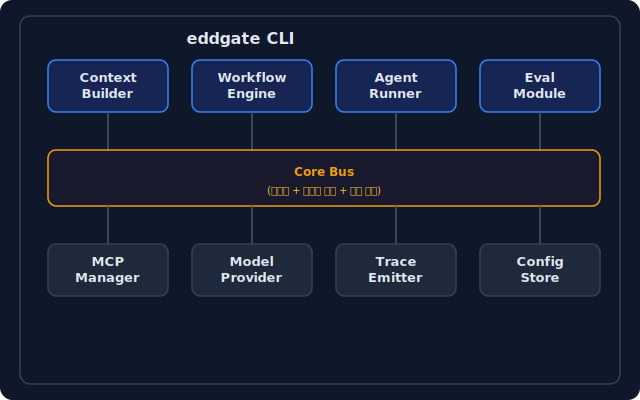
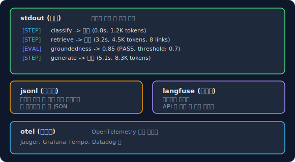
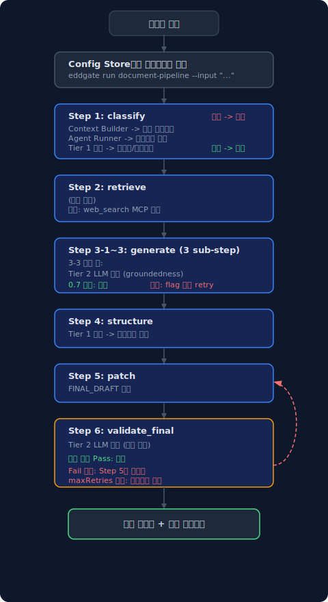
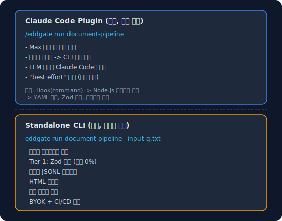
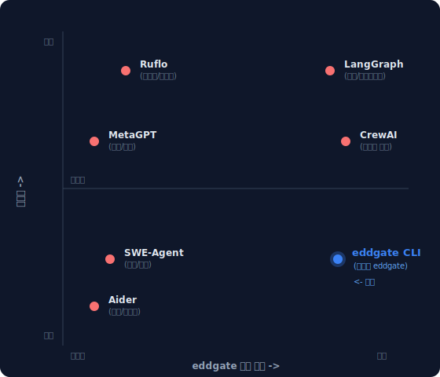

# eddgate: Architecture

> Version: 0.1.0
> Date: 2026-03-29

---

## What eddgate is

A self-improving evaluation loop for LLM workflows:

```
run -> analyze -> test -> run (improved) -> ...
```

Three things combined that don't exist together anywhere else:
1. **Validation gates** (EDDOps) -- deterministic checks between workflow steps
2. **Error analysis** (Hamel Husain's approach) -- cluster failures, auto-generate rules
3. **Regression testing** (Percy/Chromatic for agents) -- snapshot behavior, diff changes

---

## Design Principles

1. **Less is more** -- 100-token summary > 10,000-token raw (Anthropic)
2. **Default simple** -- single agent, pipeline topology, add complexity only when needed
3. **Gates not walls** -- rule-based checks every step, LLM eval only at key transitions
4. **Observe don't platform** -- JSONL traces + Langfuse/OTel hooks, not a custom dashboard
5. **Loop not line** -- failures feed back as rules for the next run
6. **Reproducible** -- same input = same execution path

---

## 시스템 개요

<p align="center">
  
</p>

---

## 모듈 상세

### 1. Context Builder

**목적**: 실행 안정성과 재현성 확보. 프롬프트가 아닌 실행 정의가 중심.

**설계 (CRITICAL_ANALYSIS 반영)**:
- 무거운 JSON 스키마 강제가 아닌 **최소 실행 컨텍스트**
- "적을수록 낫다" — context rot은 50K 토큰부터 시작 (Chroma 연구)

```typescript
// 실행 컨텍스트 최소 구조 — 이것만 강제
interface ExecutionContext {
  state: "classify" | "retrieve" | "generate" | "validate" | "transform" | "human_approval" | "record_decision";
  identity: {
    role: string;        // "link_researcher" | "content_consolidator" | ...
    model: string;       // "sonnet"
    constraints: string[]; // ["raw_url_only", "no_hallucination"]
  };
  tools: string[];       // ["web_search", "file_read", ...]
  // memory는 선택적 — 기본값은 없음. 필요할 때만 주입
  memory?: {
    summary: string;     // 100토큰 이하 요약
    previousStepOutput?: string; // 이전 단계 결과 (필요할 때만)
  };
}
```

**하지 않는 것**:
- [no] 범용 메모리 계층 (hot/cold/archival) — MemGPT/Letta가 실패한 이유
- [no] 자동 컨텍스트 요약 — JetBrains: LLM 요약이 관찰 마스킹보다 4/5에서 패배
- [no] 전체 대화 히스토리 주입 — context rot 유발

**하는 것**:
- [done] 실행 컨텍스트를 코드로 고정 (재현 가능)
- [done] 각 단계에 필요한 최소 정보만 전달
- [done] 이전 단계 결과는 필요할 때만 명시적으로 주입
- [done] State transition validation -- 의심스러운 상태 전환 시 경고 (예: classify -> validate 직행)
- [done] Safe JSON truncation -- 잘린 JSON이 malformed 출력을 만들지 않도록 보장
- [done] MCP tool name validation -- mcp:server:tool 형식 검증 (잘못된 도구명 사전 차단)

---

### 2. Workflow Engine

**목적**: 단발성 실행 제거. 동일한 실행 순서와 판단 분리 보장.

**핵심 규칙 (당신의 실무 기준에서)**:
1. 검색과 생성은 반드시 별도 Step
2. Validation Step 필수
3. 근거 부족 결과는 다음 단계 전달 금지

```typescript
interface WorkflowDefinition {
  name: string;
  description: string;
  steps: StepDefinition[];
  // 워크플로우 수준 설정
  config: {
    defaultModel: string;          // 기본 모델 (단일 프로바이더 권장)
    topology: "single" | "pipeline" | "parallel"; // 사용자 명시 선택
    onValidationFail: "block" | "flag" | "retry";
  };
}

interface StepDefinition {
  id: string;
  name: string;
  type: "classify" | "retrieve" | "generate" | "validate" | "transform" | "human_approval";
  // 단계별 모델 오버라이드 (선택적, 기본은 워크플로우 모델)
  model?: string;
  // 실행 컨텍스트 (Context Builder가 생성)
  context: ExecutionContext;
  // 규칙 기반 검증 (매 단계, 비용 0)
  validation?: {
    rules: ValidationRule[];  // 스키마 체크, 필수 필드, 포맷
  };
  // LLM 평가 (핵심 전환점에서만, 선택적)
  evaluation?: {
    enabled: boolean;
    type: "groundedness" | "relevance" | "custom";
    threshold: number;       // 0.0 ~ 1.0
    onFail: "block" | "flag" | "retry";
  };
  // 의존성
  dependsOn?: string[];      // 이전 단계 ID
  // 출력 스키마 (다음 단계 입력으로 전달될 구조)
  outputSchema?: JSONSchema;
}

interface ValidationRule {
  type: "schema" | "required_fields" | "format" | "length" | "regex" | "range" | "enum" | "not_empty" | "custom";
  spec: Record<string, unknown>;
  message: string;           // 실패 시 메시지
}
```

**당신의 6단계 파이프라인을 이 구조로 매핑하면**:

```yaml
# workflows/document-pipeline.yaml
name: "eddgate Document Pipeline"
description: "6단계 문서 처리 파이프라인 (실무 검증)"

config:
  defaultModel: "sonnet"
  topology: "pipeline"
  onValidationFail: "block"

steps:
  # Step 1: 문제 구체화
  - id: "classify"
    name: "문제 구체화"
    type: "classify"
    context:
      state: "classify"
      identity:
        role: "problem_analyzer"
        constraints: ["답변 섹션 제목 형태로 정리"]
      tools: []
    validation:
      rules:
        - type: "required_fields"
          spec: { fields: ["topics"] }
          message: "문제 항목 리스트 필수"
        - type: "schema"
          spec: { topics: "array", minItems: 1 }
          message: "최소 1개 이상의 문제 항목"
    outputSchema:
      type: "object"
      properties:
        topics: { type: "array", items: { type: "string" } }

  # Step 2: 링크 수집
  - id: "retrieve"
    name: "문제별 관련 링크"
    type: "retrieve"
    context:
      state: "retrieve"
      identity:
        role: "link_researcher"
        constraints: ["raw_url_only", "추정_창작_금지", "확인된_링크만"]
      tools: ["web_search"]
    dependsOn: ["classify"]
    validation:
      rules:
        - type: "regex"
          spec: { pattern: "^https?://", field: "urls" }
          message: "URL은 http/https로 시작해야 함"
        - type: "required_fields"
          spec: { fields: ["link_pack"] }
          message: "문제별 링크 패키지 필수"

  # Step 3: 답변 생성 (3-sub-step)
  - id: "generate_taxonomy"
    name: "Taxonomy Design + Classification"
    type: "generate"
    dependsOn: ["retrieve"]
    context:
      state: "generate"
      identity:
        role: "content_consolidator"
        constraints: ["문장_다듬기_금지", "developmental_editing"]
      tools: []
    validation:
      rules:
        - type: "required_fields"
          spec: { fields: ["issue_brief", "redundancy_log"] }
          message: "ISSUE_BRIEF와 REDUNDANCY_LOG 필수"

  - id: "generate_flow"
    name: "Flow Editing"
    type: "generate"
    dependsOn: ["generate_taxonomy"]
    context:
      state: "generate"
      identity:
        role: "flow_editor"
        constraints: ["새로운_사실_추가_금지", "결론_근거_조건_예외_액션_순서"]
      tools: []

  - id: "generate_citation"
    name: "Citation Editing"
    type: "generate"
    dependsOn: ["generate_flow"]
    # ── 핵심 전환점: 검색→생성 결과 합류. 여기서만 LLM 평가 ──
    evaluation:
      enabled: true
      type: "groundedness"
      threshold: 0.7
      onFail: "flag"
    context:
      state: "generate"
      identity:
        role: "copy_citation_editor"
        constraints: ["본문에_직접_링크_금지", "[n]_인용만", "raw_url_only_reference"]
      tools: []

  # Step 4: 구조 설계
  - id: "structure"
    name: "문서 구조 설계"
    type: "transform"
    dependsOn: ["generate_citation"]
    context:
      state: "validate"
      identity:
        role: "information_architect"
        constraints: ["내용_변경_금지", "구조만_설계"]
      tools: []
    validation:
      rules:
        - type: "required_fields"
          spec: { fields: ["outline", "section_mapping"] }
          message: "아웃라인과 섹션 매핑 필수"

  # Step 5: 패치 실행 + 문서 생성
  - id: "patch"
    name: "문서화 검증 및 생성"
    type: "generate"
    dependsOn: ["structure"]
    context:
      state: "generate"
      identity:
        role: "patch_executor"
        constraints: ["VALIDATION_TABLE의_FAIL/AMBIG만_수정"]
      tools: ["file_write"]

  # Step 6: 최종 검증 (반복 루프)
  - id: "validate_final"
    name: "최종 검증"
    type: "validate"
    dependsOn: ["patch"]
    # ── 핵심 전환점: 최종 산출물 검증. LLM 평가 ──
    evaluation:
      enabled: true
      type: "custom"
      threshold: 0.7  # industry standard (LLM judge agreement ~80-85%, 0.9+ is unreachable)
      onFail: "retry"  # patch 단계로 되돌리고 재실행
    context:
      state: "validate"
      identity:
        role: "artifact_validator"
        constraints: ["수정_금지", "Pass/Fail만_판정"]
      tools: []
    validation:
      rules:
        - type: "custom"
          spec: { check: "all_sections_present" }
          message: "필수 섹션 누락"
        - type: "custom"
          spec: { check: "reference_consistency" }
          message: "[n] 인용과 Reference 불일치"
```

**토폴로지 옵션 (사용자 명시 선택)**:

```yaml
# 기본값: single — 한 에이전트가 순차 실행
topology: "single"

# pipeline — 단계별로 다른 에이전트 (당신의 6단계처럼)
topology: "pipeline"

# parallel — 독립 단계를 병렬 실행 (classify+retrieve 동시 등)
topology: "parallel"
```

자동 선택 없음. Google 연구 결론: 자동 선택의 13% 오분류 × -70% 최악 = 프로덕션 불가.

---

### 3. Agent Runner

**목적**: 에이전트 역할 정의와 실행.

```typescript
interface AgentRole {
  id: string;
  name: string;                    // "backend_dev" | "qa_engineer" | ...
  description: string;
  systemPrompt: string;            // 역할 프롬프트
  model: string;                   // 기본 모델
  tools: string[];                 // 사용 가능한 도구
  mcpServers?: string[];           // 연결할 MCP 서버
  constraints: string[];           // 제약 조건
}
```

**사전 정의 역할 (프로젝트 요구사항)**:

| 역할 | 설명 | 기본 도구 |
|------|------|---------|
| `backend_dev` | 백엔드 코드 생성/수정 | file_read, file_write, shell, web_search |
| `frontend_dev` | 프론트엔드 코드 생성/수정 | file_read, file_write, shell, web_search |
| `ai_engineer` | AI/ML 관련 작업 | file_read, file_write, shell, web_search, model_eval |
| `qa_engineer` | 테스트 작성/실행/검증 | file_read, shell, test_runner |
| `code_reviewer` | 코드 리뷰/품질 검증 | file_read, git_diff, lint |
| `doc_writer` | 문서 작성/정리 | file_read, file_write, web_search |
| `link_researcher` | 근거 링크 수집/검증 | web_search |
| `validator` | 산출물 검증 (수정 금지) | file_read |

**사용자 정의 역할**: YAML로 자유롭게 추가 가능.

---

### 4. Eval Module

**목적**: eddgate 정신 — 평가가 사후가 아닌 설계에 내장. 단, 현실적으로.

**CRITICAL_ANALYSIS 반영 — 3-tier 평가**:

```
Tier 1: 규칙 기반 검증 (매 단계, 비용 0, 5-10ms)
  → 스키마 체크, 필수 필드, 포맷, regex, 길이, range, enum, not_empty
  → 100% 결정적. 오탐 0%.

Tier 2: LLM 평가 (핵심 전환점만, 1-5초, 선택적)
  → groundedness, relevance, custom rubric
  → 검색→생성 합류점, 최종 산출물에서만 활성화
  → 결과는 "block" 또는 "flag" (flag = 진행하되 경고)

Tier 3: 사후 오프라인 분석 (비동기, 제한 없음)
  → 전체 트레이스 기반 회고적 품질 분석
  → Braintrust/DeepEval/RAGAS 통합
  → CI/CD에서 실행 (프롬프트 변경 시 자동 트리거)
```

```typescript
// Tier 1: 규칙 기반 (동기, 매 단계)
interface RuleValidation {
  type: "schema" | "required_fields" | "format" | "regex" | "length" | "range" | "enum" | "not_empty";
  spec: Record<string, unknown>;
  // 실패 시: 즉시 차단. 다음 단계 전달 금지.
}

// Tier 2: LLM 평가 (동기, 핵심 전환점만)
interface LLMEvaluation {
  type: "groundedness" | "relevance" | "custom";
  model?: string;        // 평가 전용 모델 (기본: 소형 모델)
  rubric: string;        // 평가 기준
  threshold: number;     // 0.0 ~ 1.0
  onFail: "block" | "flag" | "retry";
  maxRetries?: number;   // retry 시 최대 재시도 (기본: 2)
}

// Tier 3: 사후 분석 (비동기)
interface OfflineEval {
  type: "batch_groundedness" | "batch_relevance" | "regression" | "custom";
  dataset: string;       // 평가 데이터셋 경로
  output: string;        // 결과 저장 경로
  // CI/CD 통합: 프롬프트/워크플로우 변경 시 자동 실행
  trigger: "on_prompt_change" | "on_workflow_change" | "manual" | "cron";
}
```

---

### 5. MCP Manager

**목적**: 도구/RAG/외부 서비스를 플러그 앤 플레이로 연결.

```typescript
interface MCPConfig {
  servers: MCPServerDefinition[];
}

interface MCPServerDefinition {
  name: string;
  transport: "stdio" | "http" | "sse";
  command?: string;        // stdio: 실행 명령
  url?: string;            // http/sse: 서버 URL
  env?: Record<string, string>;
  // 에이전트별 접근 제어
  allowedRoles?: string[]; // 이 MCP를 사용할 수 있는 역할
}
```

**기본 탑재 MCP**:
- `web_search` — 웹 검색 (Firecrawl, Brave, 등)
- `file_ops` — 파일 읽기/쓰기/검색
- `shell` — 셸 명령 실행
- `git` — Git 작업

**사용자 추가 MCP**: 설정 파일에 선언하면 자동 연결.

---

### 6. Model Provider

**목적**: 단일 프로바이더 기본값 + 선택적 오버라이드.

**CRITICAL_ANALYSIS 반영**:
- 기본값: 단일 프로바이더, 단일 모델 패밀리
- 매 단계 다른 프로바이더는 비권장 (API 비호환, 테스트 폭발, 장애 전파)
- 현실적 최대: 소형(분류/검증) + 대형(생성) 2-tier

```typescript
interface ModelConfig {
  // 기본 모델 (모든 단계에서 사용)
  default: string;               // "sonnet"
  // 선택적 오버라이드 (사용자 명시)
  overrides?: {
    classify?: string;           // 분류용 (소형 모델 가능)
    generate?: string;           // 생성용 (대형 모델)
    validate?: string;           // 검증용 (소형 모델 가능)
  };
  // AI Gateway 설정 (선택적)
  gateway?: {
    enabled: boolean;
    fallback?: string[];         // 폴백 모델 리스트
    tags?: string[];
  };
  // 직접 프로바이더 (Gateway 미사용 시)
  provider?: {
    type: "anthropic" | "openai" | "google" | "custom";
    apiKey: string;              // 환경변수 참조
    baseUrl?: string;
  };
}
```

---

### 7. Trace Emitter

**목적**: 관측 가능한 프레임워크. 자체 플랫폼이 아닌 훅 + 통합.

**CRITICAL_ANALYSIS 반영**:
- 자체 관측 플랫폼 구축 안 함 (50-100 인월)
- 구조화 JSON 로깅 (day 1, 비용 0)
- Langfuse/OTel 통합 (선택적)
- 콜백 훅으로 커뮤니티 확장

```typescript
interface TraceEvent {
  timestamp: string;           // ISO 8601
  traceId: string;             // 전체 실행 추적 ID
  spanId: string;              // 현재 span ID
  parentSpanId?: string;       // 부모 span ID (span hierarchy 지원)
  stepId: string;              // 현재 단계 ID
  type: "step_start" | "step_end" | "llm_call" | "tool_call" | "validation" | "evaluation" | "error";
  // 실행 컨텍스트 스냅샷 (재현용)
  context: ExecutionContext;
  // 상세
  data: {
    model?: string;
    inputTokens?: number;
    outputTokens?: number;
    latencyMs?: number;
    cost?: number;             // USD 추정
    validationResult?: "pass" | "fail";
    evaluationScore?: number;
    error?: string;
  };
}

// 출력 대상 (동시 다중 출력 가능)
interface TraceOutput {
  type: "stdout" | "jsonl_file" | "langfuse" | "otel" | "custom";
  config?: Record<string, unknown>;
}

// TraceEmitter API
// emitter.toolCall(stepId, toolName, input, output) -- tool 호출 기록 (span hierarchy 자동)
// emitter.flush() -- 버퍼에 쌓인 이벤트를 출력 대상으로 강제 전송
// MAX_BUFFER_SIZE = 10,000 -- 버퍼 초과 시 자동 flush
```

**로깅 전략**:

<p align="center">
  
</p>

---

### 8. Config Store

**목적**: 프롬프트, 워크플로우, 역할을 버전 관리 가능한 파일로 관리.

```
project/
├── eddgate.config.yaml          # 프로젝트 설정 (모델, MCP, 트레이스)
├── workflows/
│   ├── document-pipeline.yaml  # 6단계 문서 파이프라인
│   ├── code-review.yaml        # 코드 리뷰 워크플로우
│   ├── bug-fix.yaml            # 버그 수정 워크플로우
│   ├── api-design.yaml         # API 설계 워크플로우
│   ├── translation.yaml        # 번역 워크플로우
│   └── rag-pipeline.yaml       # RAG 인덱싱 파이프라인 (Pinecone MCP)
├── roles/
│   ├── backend_dev.yaml
│   ├── qa_engineer.yaml
│   └── custom_role.yaml
├── prompts/
│   ├── link_researcher.md      # 역할별 시스템 프롬프트
│   ├── content_consolidator.md
│   └── artifact_validator.md
├── eval/
│   ├── rules/                  # Tier 1 규칙 정의
│   ├── rubrics/                # Tier 2 LLM 평가 기준
│   └── datasets/               # Tier 3 오프라인 평가 데이터
└── traces/                     # 실행 트레이스 (jsonl)
```

**모든 것이 Git에 들어감** → 프롬프트 버전관리, 워크플로우 변경 이력, 평가 기준 변경 추적.
이것이 GenAIOps의 핵심: `prompt_versioning` + `workflow_versioning` = Git.

---

## 실행 흐름

<p align="center">
  
</p>

**LLM 평가는 2곳에서만**: Step 3 완료 후 (검색→생성 합류) + Step 6 (최종 검증).
나머지는 전부 규칙 기반 (비용 0, 5-10ms).

---

## 출력 레이어 (렌더러)

동일한 `WorkflowResult` 데이터에 3가지 렌더러:

```
WorkflowResult (단일 데이터 소스)
    │
    ├─→ StdoutRenderer   — 실행 중 실시간 로그 (항상)
    ├─→ TUIRenderer      — 실행 완료 후 터미널 대시보드 (--tui)
    └─→ HTMLRenderer     — 정적 리포트 파일 (--report)
```

### StdoutRenderer (Phase 1, 구현 완료)

실행 중 단계별 진행 상황을 실시간으로 터미널에 출력.

### HTMLRenderer (Phase 1)

`eddgate run ... --report report.html` → 싱글 HTML 파일 생성.
- 의존성 0. 순수 HTML/CSS/JS 문자열 템플릿
- 단계별 접기/펼치기, 평가 점수 게이지, 토큰/비용/시간 테이블
- 파트너사에 파일 하나 보내면 끝
- 전체 트레이스 JSON 다운로드 버튼 포함

### TUIRenderer (Phase 2)

`eddgate run ... --tui` → 실행 완료 후 인터랙티브 터미널 대시보드.
- 단계 목록 + 상세 패널 (2-pane)
- 화살표 키로 단계 이동, Enter로 입출력 보기
- 평가 결과 하이라이트, 실패 단계 빨간색
- 경량 라이브러리 사용 (Ink 또는 blessed-contrib)

---

## CLI 인터페이스

```bash
# 워크플로우 실행
eddgate run <workflow> --input <file> [--report <path>] [--tui] [--trace-jsonl <path>]

# 단일 단계만 실행 (디버깅용)
eddgate step <workflow> <step-id> --input <file>

# 트레이스 조회
eddgate trace <trace-id-or-file> [--format json|summary]

# 오프라인 평가
eddgate eval <workflow> [--dataset <path>] [--output <path>] [--model <model>]

# 워크플로우/역할 목록
eddgate list workflows
eddgate list roles
```

---

## 기술 스택

| 레이어 | 선택 | 이유 |
|--------|------|------|
| **언어** | TypeScript | npm 생태계, 타입 안전 |
| **LLM 호출** | Claude Agent SDK (`@anthropic-ai/claude-agent-sdk`) | Claude Code CLI 내부 호출, Max 구독 활용, API 키 불필요 |
| **CLI 프레임워크** | Commander.js | 성숙한 CLI 도구 |
| **설정 파싱** | yaml + zod v4 | YAML 설정 + 타입 안전 검증 |
| **트레이스 출력** | 자체 JSONL + stdout | 최소 비용, 확장 가능 |
| **테스트** | vitest | 빠른 실행, ESM 네이티브 |
| **렌더링** | 자체 HTML + readline TUI | 외부 의존성 0 |

---

## 프로젝트 디렉토리 구조

```
eddgate/
├── package.json
├── tsconfig.json
├── README.md
├── RESEARCH_ANALYSIS.md           # 시장 분석
├── CRITICAL_ANALYSIS.md           # 현실 검증
├── ARCHITECTURE.md                # 이 문서
│
├── src/
│   ├── cli/                       # CLI 진입점
│   │   ├── index.ts               # 메인 CLI
│   │   ├── commands/
│   │   │   ├── run.ts             # eddgate run
│   │   │   ├── step.ts            # eddgate step
│   │   │   ├── eval.ts            # eddgate eval
│   │   │   ├── trace.ts           # eddgate trace
│   │   │   ├── mcp.ts             # eddgate mcp
│   │   │   └── list.ts            # eddgate list
│   │   └── utils/
│   │
│   ├── core/                      # 핵심 모듈
│   │   ├── context-builder.ts     # 실행 컨텍스트 생성
│   │   ├── workflow-engine.ts     # 워크플로우 실행 엔진
│   │   ├── agent-runner.ts        # 에이전트 실행
│   │   ├── model-provider.ts      # 모델 호출 추상화
│   │   └── bus.ts                 # 이벤트 버스
│   │
│   ├── eval/                      # 평가 모듈
│   │   ├── tier1-rules.ts         # 규칙 기반 검증
│   │   ├── tier2-llm.ts           # LLM 평가
│   │   └── tier3-offline.ts       # 사후 분석
│   │
│   ├── mcp/                       # MCP 관리
│   │   ├── manager.ts             # MCP 서버 관리
│   │   └── builtin/               # 기본 MCP 서버
│   │       ├── web-search.ts
│   │       ├── file-ops.ts
│   │       └── shell.ts
│   │
│   ├── trace/                     # 트레이스
│   │   ├── emitter.ts             # 이벤트 발행
│   │   ├── outputs/
│   │   │   ├── stdout.ts
│   │   │   ├── jsonl.ts
│   │   │   ├── langfuse.ts
│   │   │   └── otel.ts
│   │   └── replay.ts             # 트레이스 재현
│   │
│   ├── config/                    # 설정 관리
│   │   ├── loader.ts              # YAML 로드 + Zod 검증
│   │   └── schemas.ts             # 설정 스키마 정의
│   │
│   └── types/                     # 공유 타입
│       └── index.ts
│
├── templates/                     # 기본 워크플로우/역할 템플릿
│   ├── workflows/
│   │   ├── document-pipeline.yaml # 6단계 문서 파이프라인
│   │   ├── code-review.yaml
│   │   └── bug-fix.yaml
│   ├── roles/
│   │   ├── backend_dev.yaml
│   │   ├── qa_engineer.yaml
│   │   └── ...
│   └── prompts/
│       ├── link_researcher.md
│       └── ...
│
└── tests/
    ├── unit/
    ├── integration/
    └── fixtures/
```

---

## 배포 전략: 2-Tier Architecture

### 왜 2-Tier인가

비관적 분석 결과 (CRITICAL_ANALYSIS.md + 추가 검증):
- **순수 플러그인**: 7단계 프롬프트 기반 = 32% E2E 성공률, eddgate 핵심 가치(결정적 검증, 재현성) 파괴
- **순수 CLI**: 진입 장벽 높음 (API 키 + 크레딧), MetaGPT/CrewAI 레드오션
- **2-Tier**: 코어 가치 유지 + 진입 장벽 제거

### Tier 구조

<p align="center">
  
</p>

### 코어가 포기하면 안 되는 것 (기술적 해자)

| 속성 | 구현 | 플러그인으로 대체 불가 이유 |
|------|------|----------------------|
| 결정적 검증 | `tier1-rules.ts` (Zod) | 프롬프트 검증은 확률적 (15-28% 오탐) |
| 재현 가능 실행 | `topologicalSort()` | LLM은 매번 다른 경로 가능 |
| 구조화 트레이스 | `TraceEmitter` (JSONL) | Claude 로깅은 비일관 |
| 검색↔생성 분리 | `step.type` 코드 강제 | LLM은 자연스럽게 합침 |
| 평가 게이트 | `if (onFail === "block")` | 프롬프트 "차단"은 가끔 무시 |

---

## Phase 로드맵

**Phase 1 (완료)**: CLI 코어 + 실행 검증

1. [done] Config Store — YAML 로드, Zod v4 검증
2. [done] Context Builder — 최소 실행 컨텍스트 생성
3. [done] Workflow Engine — pipeline/parallel/single 토폴로지
4. [done] Agent Runner — Claude Agent SDK (Max 구독, API 키 불필요)
5. [done] Eval Tier 1 — 규칙 기반 검증 (Zod, 오탐 0%)
6. [done] Eval Tier 2 — LLM 평가 (핵심 전환점, score 0~1 정규화)
7. [done] Trace (stdout + JSONL) — 구조화 로깅
8. [done] HTML 리포트 생성 (다크모드, 접기/펼치기)
9. [done] TUI 대시보드 (readline, 화살표 키 이동)
10. [done] CLI 커맨드: run, list, step, trace, eval
11. [done] human_approval 단계 타입
12. [done] 워크플로우 템플릿 3종 (document-pipeline, code-review, bug-fix)
13. [done] 역할 프롬프트 8개
14. [done] 유닛 테스트 219개 통과
15. [done] 8단계 파이프라인 실행 성공 (627s, 37K tokens, Max 구독)
16. [done] npm 패키지 준비

**Phase 2 (완료)**: 고도화

17. [done] Langfuse/OTel 트레이스 어댑터 (선택적 의존성)
18. [done] Tier 3 오프라인 평가 + 회귀 감지
19. [done] diff-eval (프롬프트 변경 전후 비교)
20. [done] MCP 서버 관리 (mcp list/add/remove)
21. [done] 추가 워크플로우 템플릿 (api-design, translation, rag-pipeline)
22. [done] GitHub Actions CI/CD (ci.yml, eval.yml)
23. [done] 워크플로우 시각화 (Mermaid/ASCII)

**Phase 3 (완료)**: GenAIOps 파이프라인

24. [done] monitor 커맨드 (status/cost/quality 집계)
25. [done] gate 커맨드 (배포 게이트, 규칙 기반 pass/fail)
26. [done] version-diff (프롬프트/워크플로우 버전 비교)
27. [done] model-provider 실제 연결 (config overrides by step type)
28. [done] record_decision 단계 타입 (감사 추적)
29. [done] E2E Trace에 retrieval chunk ID/source 추적
30. [done] Context Engineering 강제: retrieve 단계 실행 컨텍스트 분리 (코드 강제)
31. [done] gate-rules.yaml 템플릿
32. [done] RAG 인덱싱 파이프라인 (Pinecone MCP 통합, rag-pipeline 워크플로우)
33. [done] A/B 프롬프트 테스트 (Welch's t-test 기반 통계 검정, ABABAB 인터리빙)

**미래 (선택)**:

- Claude Code 플러그인 래퍼
- 웹 대시보드

---

## 경쟁 포지셔닝 (최종)

<p align="center">
  
</p>

**한 줄 포지셔닝**: "평가가 내장된 실용적 멀티에이전트 CLI. Ruflo의 야심 없이, SWE-Agent의 단순함으로, eddgate의 정신을."
