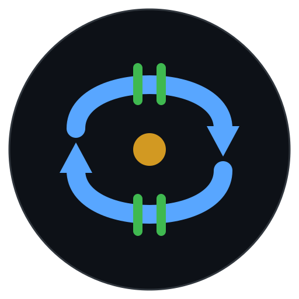

<p align="center">
  
</p>

<h1 align="center">eddgate</h1>

<p align="center">LLM 워크플로우를 위한 자가 개선 평가 루프</p>

<p align="center">풀스크린 터미널 UI. 워크플로우 실행, 실패 분석, 규칙 자동 생성, 회귀 테스트. 하나의 도구, 하나의 루프.</p>

> **Promptfoo에서 오셨나요?** eddgate는 Promptfoo가 열어둔 루프를 닫습니다: 실패를 분석하고, 규칙을 자동 생성하고, 다음 실행에 적용합니다. 어떤 AI 제공자에게도 데이터를 보내지 않습니다. 완전한 셀프호스팅.

```
run -> analyze -> test -> run (개선됨) -> ...
```

## 설치

```bash
npm install -g eddgate
```

요구사항: Node.js 20+, Claude CLI (아무 구독) 또는 ANTHROPIC_API_KEY

## 시작하기

```bash
eddgate
```

이것만 실행하면 됩니다. 풀스크린 터미널 UI가 시작됩니다. 메뉴에서 실행, 분석, 테스트를 선택하세요.

```
+---------------------------+----------------------------------------------------+
|  eddgate                  |                                                    |
+---------------------------+                                                    |
|                           |                                                    |
|  > 실행                    |   워크플로우, 모델, 노력 수준, 입력을               |
|    분석                    |   선택하면 라이브로 실행 과정을 볼 수 있습니다.      |
|    테스트                  |                                                    |
|    MCP                    |   왼쪽 패널: 단계별 진행 상태                        |
|    플러그인                |   오른쪽 패널: 스트리밍 로그                         |
|    설정                    |   헤더: 토큰, 비용, 경과 시간                       |
|    종료                    |                                                    |
|                           |                                                    |
+---------------------------+----------------------------------------------------+
|  방향키: 이동  |  Enter: 선택  |  Esc: 뒤로  |  q: 종료  |  ?: 도움말           |
+------------------------------------------------------------------------+
```

모든 것이 TUI 안에서 이루어집니다: 라이브 대시보드로 워크플로우 실행, 실패 분석, 회귀 테스트, MCP 서버 관리, 플러그인 가져오기, 언어 전환.

### CLI 모드 (CI/자동화용)

TUI의 모든 기능은 스크립팅과 CI 파이프라인을 위한 CLI 명령어로도 사용할 수 있습니다:

```bash
eddgate init                          # 프로젝트 생성
eddgate doctor                        # 환경 확인
eddgate run example -i input.txt      # 워크플로우 실행
eddgate analyze -d traces             # 실패 패턴 분석
eddgate test snapshot -d traces       # 현재 동작 기준선 저장
eddgate test diff -d traces           # 회귀 감지
```

## 언제 쓰나요?

eddgate는 **품질이 중요한 모든 다단계 AI 작업**을 위한 도구입니다. ChatGPT에 복사-붙여넣기하면서 결과를 기도하듯 기다리고 있었다면, eddgate가 그걸 반복 가능하고 검증 가능한 파이프라인으로 바꿔줍니다.

### 실제 시나리오

| 하고 싶은 일 | 사용할 워크플로우 | 넣어야 할 것 | 얻는 결과 |
|---|---|---|---|
| 긴 보고서를 인용 포함해서 요약 | `document-pipeline` | `report.pdf` 또는 `report.md` | `[1]` 인용과 참고 문헌 목록이 포함된 구조화된 요약 |
| 기술 문서를 한국어로 번역하고 정확도 검증 | `translation` | `docs/api-guide.md` (영어) | 한국어 번역 + 정확도 검증 점수 |
| PR diff에서 버그 찾기 | `code-review` | `git diff > changes.txt` | 심각도, 줄 번호, 수정 제안이 포함된 이슈 목록 |
| 프로덕션 에러 디버깅 | `bug-fix` | 에러 로그 텍스트 | 근본 원인 분석 + 수정 제안 + 검증 |
| 사내 문서 기반 질문 답변 | `rag-pipeline` | 질문 텍스트 (문서 사전 인덱싱 필요) | 출처 인용이 포함된 근거 기반 답변, 환각 점수 |
| 고객 불만을 구조화된 데이터로 변환 | 커스텀 워크플로우 | `complaints.csv` 또는 이메일 텍스트 | 카테고리, 긴급도, 권장 조치가 포함된 JSON |

### 처음이라면 여기서 시작하세요

```bash
eddgate                    # TUI 실행
# 1. 메뉴에서 "실행" 선택
# 2. "document-pipeline" (또는 아무 워크플로우) 선택
# 3. "파일 선택" -> .txt 또는 .md 파일 선택
# 4. 모델: Sonnet (기본값, 대부분의 작업에 충분)
# 5. 먼저 "드라이 런"으로 구조 확인 (비용 없음)
# 6. 준비되면 "바로 실행"으로 라이브 대시보드 확인
```

실행 후 결과 패널을 확인하세요. 품질이 괜찮으면 다음 실행에서 "JSONL 트레이스 저장"을 활성화하세요 -- 이 트레이스 파일이 분석, 테스트, 모니터 기능의 원천 데이터입니다.

### 일반적인 워크플로우

```
Day 1:  트레이스 활성화 후 실행 -> 기준 결과 확보
Day 2:  실패 분석 -> 규칙 자동 생성
Day 3:  다시 실행 -> 규칙 자동 적용, 품질 향상
Day 4:  스냅샷 테스트 -> 현재 좋은 상태 저장
Day N:  프롬프트 수정 -> 비교 테스트 -> 회귀 없음 확인 -> 배포
```

## 루프

```
1. 실행          검증 게이트와 함께 워크플로우 실행
      |
2. 분석          실패 패턴 분석, 규칙 자동 생성
      |
3. 실행          다시 실행 -- 생성된 규칙 자동 적용
      |
4. 테스트 스냅샷  현재 동작을 기준선으로 저장
      |
   (프롬프트/워크플로우 수정)
      |
5. 테스트 비교   기준선 대비 회귀 감지
      |
   ... 반복
```

다른 도구는 이걸 못 합니다. Promptfoo는 평가만. Braintrust는 모니터링만. LangWatch는 추적만. 실패 분석에서 실행 개선까지 하나의 도구로 연결하는 건 eddgate뿐입니다.

## 검증 게이트

**이것은 무엇인가?** 각 단계 사이에 자동으로 실행되는 품질 체크포인트입니다. 한 단계의 출력이 엉망이면 다음 단계에 토큰을 낭비하지 않고 파이프라인이 즉시 멈춥니다. 별도로 설정할 필요 없이 워크플로우 YAML에 정의된 대로 자동 실행됩니다.

```
입력 -> [단계 1] -> [게이트] -> [단계 2] -> [게이트] -> [단계 3] -> [게이트] -> 출력
                      |                     |                     |
                    통과?                  통과?                 통과?
                    실패 = 멈춤            실패 = 멈춤           실패 = 멈춤
```

두 단계:
- **Tier 1**: Zod 스키마 검증. 결정적. 0% 오탐. 5ms. 매 단계.
- **Tier 2**: LLM 평가. 근거기반성/관련성. 핵심 전환점에서만.

## 실패 분석

**언제 사용하나?** 워크플로우를 실행했는데 결과가 나빴을 때 (실패한 단계, 낮은 품질 점수, 예상 밖의 출력). 이 명령어는 트레이스 파일을 읽고 *무엇이* 잘못됐는지, *얼마나 자주* 발생하는지, *어떻게 고칠 수 있는지* 알려줍니다. 같은 실패를 방지하는 규칙을 자동 생성할 수도 있습니다.

```bash
eddgate analyze -d traces
```

```
  105개 실패, 2개 패턴:

  C1 "validate_final"에서 평가 게이트 실패 (평균 점수: 0.75, 103회)
     103회 발생 (98%)
     점수 범위: 0.42 - 0.85
     수정: 임계값을 낮추거나 프롬프트 구체화
     규칙: validate_final_adjusted_threshold.yaml

  C2 "validate_final"에서 Rate limit (2회)
     수정: 단계 간 딜레이 추가 또는 maxRetries 줄이기
```

```bash
eddgate analyze -d traces --generate-rules    # 규칙 자동 생성
eddgate analyze -d traces --context           # 컨텍스트 윈도우 프로파일러
```

생성된 규칙은 다음 `eddgate run`에서 자동 로드됩니다.

## 회귀 테스트

**언제 사용하나?** 파이프라인이 잘 동작하고 있을 때, 앞으로의 변경(프롬프트 수정, 모델 교체, 설정 변경)이 품질을 떨어뜨리지 않는지 확인하고 싶을 때. AI 파이프라인을 위한 유닛 테스트라고 생각하면 됩니다.

```bash
eddgate test snapshot -d traces     # 기준선 저장
# ... 프롬프트 수정 ...
eddgate run my-workflow -i input.txt --trace-jsonl traces/new.jsonl
eddgate test diff -d traces         # 기준선과 비교
```

```
  회귀 (1):
    validate_final.evalScore
      이전: 0.78
      이후: 0.65
      -> 회귀 감지

  통과: 회귀 없음.  (또는)  실패: 회귀 감지됨.
```

CI에서 exit code 1 반환. GitHub Actions 연동 가능.

## 컨텍스트 윈도우 프로파일러

**언제 사용하나?** 워크플로우 비용이 예상보다 높거나, 실행 시간이 너무 길 때. 프로파일러는 트레이스를 분석해서 어떤 단계가 토큰(= 돈)을 가장 많이 소모하는지 정확히 보여줍니다. 흔한 발견: 검증 단계가 2회면 될 재시도를 48회 반복하는 경우.

```bash
eddgate analyze -d traces --context
```

```
  단계별 분석:

  단계                        호출  입력       출력       전체       비율
  retrieve                  1      935        3,655      4,590      15.4%  ====
  generate_citation         2      6          6,908      6,914      23.2%  ======
  validate_final            48     63,744     38,400     102,144    34.3%  =========

  낭비 감지:
    "validate_final"이 48회 호출 (예상 2회) -- 재시도로 ~100K 토큰 낭비

  권장사항:
    "validate_final"의 재시도 횟수를 줄이거나 평가 임계값을 낮추세요
```

## TUI

`eddgate`를 실행하면 풀스크린 터미널 UI가 시작됩니다. 명령어를 외울 필요 없이 메뉴에서 모든 기능에 접근할 수 있습니다.

| 메뉴 | 설명 |
|------|------|
| **실행** | 워크플로우, 모델, 노력 수준, 사고 모드, 입력 선택. 실행 옵션(HTML 리포트, JSONL 트레이스, 예산 한도, 드라이 런) 설정. 라이브 대시보드. 완료 후 결과 패널에 단계별 테이블 표시. |
| **분석** | 실패 분석, 컨텍스트 프로파일러, 오프라인 평가, A/B 프롬프트 테스트, diff-eval, version-diff. |
| **테스트** | 스냅샷 저장, 기준선 비교, 스냅샷 목록, 배포 게이트(임계값 확인). |
| **모니터** | 상태 개요(성공률 게이지, 메트릭 테이블), 비용 분석(모델별 바 차트, 단계별 테이블), 품질 점수(평가 평균과 분포 바). 저장된 트레이스 기반. |
| **트레이스** | 저장된 트레이스 파일 탐색. 선택하면 단계 요약(왼쪽) + 전체 이벤트 타임라인(오른쪽)을 컬러 코딩된 이벤트로 표시. |
| **MCP** | YAML 편집 없이 MCP 서버 추가/제거/목록. |
| **플러그인** | 워크플로우/역할 확인, 워크플로우 시각화, 단일 단계 디버그, RAG 인덱스/검색(Pinecone MCP), 파일 가져오기. |
| **설정** | 기본 모델, 언어(한국어/영어), 설정 보기, Doctor(환경 진단), Init(프로젝트 생성). |

키보드: 방향키로 이동, Enter로 선택, Esc로 뒤로, q로 종료, Tab으로 패널 전환, ?로 도움말.

### 실행 옵션

워크플로우/모델/노력/사고 모드 선택 후, 실행 옵션 메뉴에서 추가 설정:

| 옵션 | 설명 |
|------|------|
| **바로 실행** | 현재 설정으로 진행. |
| **HTML 리포트 저장** | 경로 입력 -- 실행 후 다크모드 HTML 리포트 생성. |
| **JSONL 트레이스 저장** | 경로 입력 -- 실행 중 모든 이벤트 기록. |
| **예산 한도 설정** | USD 금액 입력 -- 비용 초과 시 워크플로우 중단. |
| **드라이 런** | 토글 -- 실행 없이 워크플로우 구조만 미리보기. |

여러 옵션을 동시에 설정한 후 "바로 실행"으로 시작할 수 있습니다.

### 실행 대시보드

워크플로우 실행 중 라이브 오케스트레이션 대시보드가 표시됩니다:

```
+---------------------------+----------------------------------------------------+
|  document-pipeline        |  워크플로우: document-pipeline                       |
|  sonnet | high | 42s      |  모델: sonnet  노력: high                           |
+---------------------------+  경과: 42s  토큰: 12,450  비용: $0.02               |
|                           +----------------------------------------------------+
|  [완료] classify_input    |  [단계 시작] classify_input -> classifier            |
|  [완료] retrieve_docs     |  [검증] 통과                                        |
|  [실행] generate_draft    |  [단계 종료] 완료 3.2s (2,100 토큰)                 |
|  [ .. ] validate_final    |  [단계 시작] retrieve_docs -> researcher             |
|  [ .. ] format_output     |  [검색] 3개 청크 (평균 점수: 0.82)                  |
|                           |  [단계 종료] 완료 5.1s (4,350 토큰)                 |
|                           |  [단계 시작] generate_draft -> writer                |
|                           |  ...                                                |
+---------------------------+----------------------------------------------------+
```

## CLI 명령어 (CI/자동화용)

TUI의 모든 기능은 스크립팅과 CI 파이프라인을 위한 명령어로도 사용할 수 있습니다.

### 핵심

| 명령어 | 설명 |
|--------|------|
| `eddgate run <workflow>` | 검증 게이트와 함께 워크플로우 실행. 잘못된 출력 시 즉시 중단. |
| `eddgate analyze` | 실패 패턴 클러스터링, 수정 제안. `--generate-rules`로 YAML 규칙 생성. `--context`로 토큰 사용량 확인. |
| `eddgate test snapshot` | 트레이스에서 현재 동작 기준선 저장. |
| `eddgate test diff` | 기준선과 비교. 회귀 시 exit 1 (CI 친화적). |
| `eddgate test list` | 저장된 스냅샷 목록. |
| `eddgate init` | 프로젝트 구조 생성. |
| `eddgate doctor` | Node.js, Claude CLI, 설정 유효성, 그래프 무결성 확인. |
| `eddgate list workflows` | 사용 가능한 워크플로우 YAML 파일 목록. |
| `eddgate list roles` | 사용 가능한 역할 정의 목록. |

### 실행 플래그

| 플래그 | 설명 |
|--------|------|
| `-i, --input <file>` | 입력 파일 또는 텍스트. 파일이면 내용을 읽음. |
| `-m, --model <model>` | 모델 오버라이드: `sonnet`, `opus`, `haiku`, `claude-opus-4-5`, `claude-sonnet-4-5` |
| `-e, --effort <level>` | 노력: `low`, `medium`, `high`, `max` |
| `--report <path>` | HTML 리포트 생성 (다크모드, 접이식 단계, 점수 게이지). |
| `--trace-jsonl <path>` | 분석용 구조화된 JSONL 트레이스 저장. |
| `--max-budget-usd <n>` | 누적 비용 초과 시 워크플로우 중단. |
| `--dry-run` | 실행 없이 워크플로우 구조 미리보기. |
| `--json` | 기계 판독 가능 JSON 출력. |
| `--quiet` | 오류만 출력. |

### 고급

| 명령어 | 설명 |
|--------|------|
| `eddgate advanced eval <workflow>` | 저장된 트레이스를 LLM 판사로 재평가. |
| `eddgate advanced diff-eval <workflow>` | git 커밋 간 평가 점수 비교. |
| `eddgate advanced gate` | 배포 게이트. 임계값 미달 시 exit 1. |
| `eddgate advanced monitor status` | 성공률, p50/p95 지연시간, 토큰, 비용. |
| `eddgate advanced monitor cost` | 모델별, 단계별 비용 분석. |
| `eddgate advanced monitor quality` | 시간별 평가 점수 추세. |
| `eddgate advanced viz <workflow>` | Mermaid 다이어그램 또는 ASCII 시각화. |
| `eddgate advanced step <workflow> <step-id>` | 디버깅을 위한 단일 단계 실행. |
| `eddgate advanced trace <file>` | JSONL 트레이스 타임라인 뷰어. |
| `eddgate advanced mcp <action>` | MCP 서버 관리: `list`, `add`, `remove`. |
| `eddgate advanced version-diff` | git 커밋 간 프롬프트/워크플로우 변경. |
| `eddgate advanced rag index` | 문서 청킹 후 Pinecone MCP로 업서트. |
| `eddgate advanced rag search <query>` | Pinecone 인덱스 검색, 순위별 청크 반환. |
| `eddgate advanced ab-test` | 같은 워크플로우를 두 프롬프트 변형으로 실행, 점수 비교. |
| `eddgate advanced improve` | 실패 패턴에서 프롬프트 수정안 자동 제안. `--apply`로 즉시 적용. |
| `eddgate serve` | HTTP API 서버 시작. `--port 3000`으로 포트 지정. |

## RAG 파이프라인 (Pinecone MCP)

**언제 사용하나?** 사내 문서(PDF, 마크다운, 텍스트 파일)가 있고, AI가 지어내는 대신 그 문서를 기반으로 질문에 답하게 하고 싶을 때. 먼저 문서를 인덱싱한 다음, `rag-pipeline` 워크플로우로 질문하면 됩니다.

```bash
# 문서 인덱싱
eddgate advanced rag index -d docs/ --index my-docs

# 검색
eddgate advanced rag search "인증은 어떻게 동작하나요?" --index my-docs
```

또는 TUI에서: **플러그인 > RAG index / RAG search**.

내장 `rag-pipeline` 워크플로우: 쿼리 분류 -> 벡터 검색 -> 근거 기반 생성 -> 근거 검증.

```yaml
steps:
  - id: "retrieve_context"
    type: "retrieve"
    context:
      tools: ["mcp:pinecone:search-records"]
  - id: "generate_answer"
    type: "generate"
    evaluation:
      type: "groundedness"
      threshold: 0.7
```

`eddgate.config.yaml`에 Pinecone MCP 서버 설정이 필요합니다.

## A/B 프롬프트 테스트

**언제 사용하나?** 프롬프트를 다시 작성했는데 새 버전이 정말 나은지, 그냥 다른 건지 확인하고 싶을 때. 같은 입력에 두 버전을 모두 실행하고 통계 검정(Welch's t-test)으로 차이가 실제인지 단순 노이즈인지 판별합니다.

```bash
eddgate advanced ab-test \
  --workflow document-pipeline \
  --prompt-a templates/prompts/analyzer.md \
  --prompt-b templates/prompts/analyzer.v2.md \
  -i input.txt \
  -n 3
```

또는 TUI에서: **분석 > A/B prompt test**.

출력 예시:

```
  Metric               Variant A      Variant B      Delta
  ──────────────────── ────────────── ────────────── ──────────────
  Avg Score            0.742          0.819          +0.077
  Avg Tokens           8,450          7,200          -1,250
  Avg Cost             $0.0234        $0.0198        -0.0036
  Avg Time             12.3s          10.8s          -1.5s

  Winner: Variant B
  Score advantage: 0.077
```

승자 로직: Welch's t-test (p < 0.05)로 통계적 유의성을 판별합니다. p-value와 95% 신뢰구간을 리포트합니다. 순서 편향을 제거하기 위해 실행을 교차 배치(ABABAB)합니다.

## 워크플로우 정의

```yaml
name: "My Pipeline"
config:
  defaultModel: "sonnet"
  topology: "pipeline"
  onValidationFail: "block"

steps:
  - id: "analyze"
    type: "classify"
    context:
      identity:
        role: "analyzer"
        constraints: ["output JSON"]
      tools: []
    validation:
      rules:
        - type: "required_fields"
          spec: { fields: ["topics"] }
          message: "topics required"

  - id: "generate"
    type: "generate"
    dependsOn: ["analyze"]
    evaluation:
      enabled: true
      type: "groundedness"
      threshold: 0.7
      onFail: "block"
```

## 병렬 실행

`topology: "parallel"`로 독립 단계를 자동 병렬 실행:

```yaml
config:
  topology: "parallel"  # 독립 단계를 동시에 실행

steps:
  - id: "search_docs"
    type: "retrieve"
    tools: ["web_search"]

  - id: "search_code"
    type: "retrieve"
    tools: ["file_read"]

  - id: "combine"
    type: "generate"
    dependsOn: ["search_docs", "search_code"]  # 둘 다 완료될 때까지 대기
```

`search_docs`와 `search_code`가 동시에 실행됩니다. `combine`은 둘 다 완료될 때까지 기다립니다. 독립적인 검색 단계가 있는 워크플로우에서 보통 30-40% 속도 향상.

## LLM 지원

자동 감지:

| 백엔드 | 설정 | 비용 |
|--------|------|------|
| Claude CLI | 아무 Claude 구독 | 구독에 포함 |
| Anthropic API | `ANTHROPIC_API_KEY` | 토큰당 과금 |

## 기본 워크플로우

| 워크플로우 | 넣어야 할 것 | 얻는 결과 | 단계 |
|-----------|-------------|----------|------|
| `document-pipeline` | 긴 문서 (.md, .txt, .pdf 텍스트) -- 예: 30페이지 정책 문서 | `[1]` 인용이 포함된 구조화된 요약, 주제별 정리, 참고 문헌 목록 | 8 |
| `code-review` | diff 파일 (`git diff > changes.txt`) 또는 코드 스니펫 | 이슈 목록: 심각도, 줄 번호, 문제점, 수정 방법 | 3 |
| `bug-fix` | 에러 로그, 스택 트레이스, 또는 버그 설명 텍스트 | 근본 원인 분석 + 수정 제안 + 수정 검증 | 4 |
| `api-design` | 요구사항 문서 또는 기능 설명 | OpenAPI 스타일 엔드포인트 설계 + 요청/응답 예시 + 문서 | 3 |
| `translation` | 원본 언어의 텍스트 파일 | 번역된 텍스트 + 역번역 정확도 점수 (오역 감지) | 3 |
| `rag-pipeline` | 질문 (문서를 먼저 플러그인 > RAG에서 인덱싱해야 함) | 문서 기반 근거 답변 + 출처 인용 + 환각 점수 | 4 |

필요한 워크플로우가 없다면 YAML을 복사해서 단계를 수정하면 커스텀 워크플로우가 됩니다. 또는 **플러그인 > 워크플로우 가져오기**로 가져올 수도 있습니다.

## 평가 임계값

기본: **0.7** (LLM-as-judge 업계 표준)

| 점수 | 의미 |
|------|------|
| 0.7+ | 통과 -- 허용 가능한 품질 |
| 0.8+ | 좋음 -- bug-fix, translation에서 사용 |
| 0.9+ | 대부분의 LLM 태스크에서 비현실적 (판사 일치도 ~80-85%) |
| < 0.7 | 실패 -- 게이트 차단, 재시도 또는 중단 |

워크플로우 YAML에서 단계별 설정 가능. `eddgate analyze`가 관찰된 점수 범위를 기반으로 조정된 임계값을 제안합니다.

## 프롬프트 자동 개선

**이럴 때 사용**: 워크플로우를 돌렸는데 일부 단계가 실패했을 때. "실패했다"만 알려주는 게 아니라 **"프롬프트를 이렇게 고치면 된다"**를 구체적으로 제안하고, 하나씩 검토해서 적용할 수 있습니다.

```bash
# CLI: 제안 후 자동 적용
eddgate advanced improve -d traces --prompts templates/prompts --apply

# CLI: 미리보기만
eddgate advanced improve -d traces --prompts templates/prompts --dry-run
```

TUI에서: **분석 > 프롬프트 자동 개선**.

### 작동 방식

```
1. traces/*.jsonl 읽기 -> 실패 패턴 클러스터링 (분석과 동일)
2. 실패한 단계의 프롬프트 파일 로드 (templates/prompts/<역할>.md)
3. 현재 프롬프트 + 실패 패턴을 AI에 보냄 -> 수정된 프롬프트 받음
4. 원본(왼쪽) vs 수정안(오른쪽) diff 화면 표시
5. 각 제안마다 선택: 승인 / 수정 / 건너뛰기
6. 승인하면 프롬프트 파일에 즉시 반영
```

### TUI 승인 화면

```
+--- 원본 프롬프트 -----+--- 수정 제안 ----------+
| 당신은 분석가입니다.   | 당신은 분석가입니다.    |
| 핵심 토픽을 추출하세요 | 핵심 토픽을 추출하세요  |
|                       | 반드시 JSON으로 출력    |  <- 추가됨
|                       | 예: {"topics": [...]}  |  <- 추가됨
+-----------------------+------------------------+
|  [승인]  [수정]  [건너뛰기]                      |
+------------------------------------------------+
```

## API 서버

**이럴 때 사용**: 웹 앱, Slack 봇, 크론 작업 등 다른 시스템에서 eddgate 워크플로우를 실행하고 싶을 때. CLI 없이 HTTP 요청으로 실행/결과 조회가 가능합니다.

```bash
eddgate serve --port 3000
```

### 엔드포인트

| 메서드 | 경로 | 설명 |
|--------|------|------|
| `GET` | `/health` | 서버 상태 확인 (버전, 가동시간) |
| `GET` | `/workflows` | 사용 가능한 워크플로우 목록 |
| `POST` | `/run` | 워크플로우 실행 시작 (runId 즉시 반환) |
| `GET` | `/runs` | 전체 실행 목록 |
| `GET` | `/runs/:id` | 실행 결과 (단계, 토큰, 비용, 평가 점수) |

### 사용 예시

```bash
# 서버 시작
eddgate serve --port 3000

# 다른 터미널에서:
# 워크플로우 실행
curl -X POST http://localhost:3000/run \
  -H "Content-Type: application/json" \
  -d '{"workflow": "document-pipeline", "input": "이 보고서를 요약해주세요..."}'
# -> {"runId": "run-1711...", "status": "running"}

# 상태 확인
curl http://localhost:3000/runs/run-1711...
# -> {"status": "completed", "result": {"totalCost": 0.02, "steps": [...]}}
```

POST /run은 즉시 `runId`를 반환하고 백그라운드에서 실행합니다. 외부 의존성 없이 Node.js 내장 `http` 모듈만 사용합니다.

## 실행 간 메모리

**이럴 때 사용**: 따로 설정할 필요 없습니다. **자동으로 동작합니다.** 워크플로우를 실행할 때마다 결과(어떤 단계가 실패했는지, 점수가 몇이었는지, 에러가 뭐였는지)를 기억합니다. 다음에 같은 워크플로우를 실행하면, 이전 실행의 교훈이 AI의 시스템 프롬프트에 자동으로 주입되어 같은 실수를 피합니다.

### 작동 방식

```
실행 #1: "validate_final" 단계가 3번 실패 -- "인용 누락"
         -> .eddgate/memory/ 에 저장됨

실행 #2: AI의 시스템 프롬프트에 자동 추가:
         "이전 실행 인사이트 (1회 실행, 성공률 0%)
          알려진 문제: validate_final 3회 실패: 인용 누락
          평균 품질: validate_final: 0.45 (문제 있음)"
         -> AI가 이번에는 인용을 넣어야 한다는 걸 알게 됨
```

### 저장되는 내용

`.eddgate/memory/` 폴더에 JSON 파일로 저장 (최대 50개, 자동 정리):

- 워크플로우 이름, 상태, 소요시간, 비용
- 단계별: 상태, 평가 점수, 에러 메시지
- 종합: 성공률, 주요 이슈, 단계별 평균 점수

### AI에 주입되는 내용

실행 전에 간결한 요약이 만들어져서 모든 에이전트의 시스템 프롬프트에 추가됩니다:

```
## 이전 실행 인사이트 (5회 실행, 성공률 60%)

이전 실행에서 알려진 문제:
- validate_final: 3회 실패 (필수 인용 누락)
- generate_draft: 2회 실패 (출력이 너무 짧음)

단계별 평균 품질 점수:
- classify_input: 0.85 (양호)
- generate_draft: 0.52 (주의 필요)
- validate_final: 0.45 (문제 있음)
```

메모리 로딩이 실패해도 워크플로우는 정상 실행됩니다.

## CI/CD 연동

```yaml
# .github/workflows/eddgate-loop.yml
name: eddgate loop
on:
  push:
    paths: ['templates/prompts/**', 'templates/workflows/**']

jobs:
  eval:
    runs-on: ubuntu-latest
    steps:
      - uses: actions/checkout@v4
      - uses: actions/setup-node@v4
        with: { node-version: 22 }
      - run: npm ci && npm run build

      # 워크플로우 그래프 검증
      - run: node dist/cli/index.js doctor --ci -w templates/workflows

      # 회귀 확인
      - run: node dist/cli/index.js test diff -d traces

      # 배포 게이트
      - run: node dist/cli/index.js advanced gate --results eval-results.json --rules templates/gate-rules.yaml
```

`test diff`는 회귀 시 exit 1. `gate`는 임계값 미달 시 exit 1. CI가 머지를 차단합니다.

## 문서

- [아키텍처](../en/ARCHITECTURE.md)

## 라이선스

MIT

---

<p align="center">
  <a href="../../README.md">English</a>
</p>
